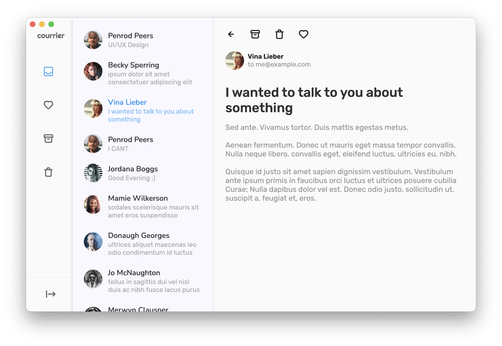

# courrier

  

  An inbox client for prototype purpose.

## Démo

[Web version](https://courrier.rootasjey.dev)

## About

This is a project is to demonstrate the use of Flutter and Firebase.

Features:

* Responsive (desktop and mobile)
* Multi-columns layout
* Router with deep linking
* Firebase database

## Getting Started

* Clone the project locally `git clone https://rootasjey.dev/courrier`
* Go inside the folder `cd courrier`
* Run the project `flutter run -d chrome`

## Licence

MIT License
